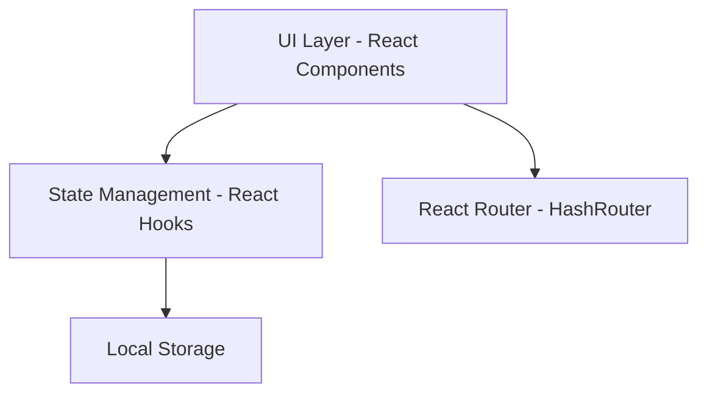
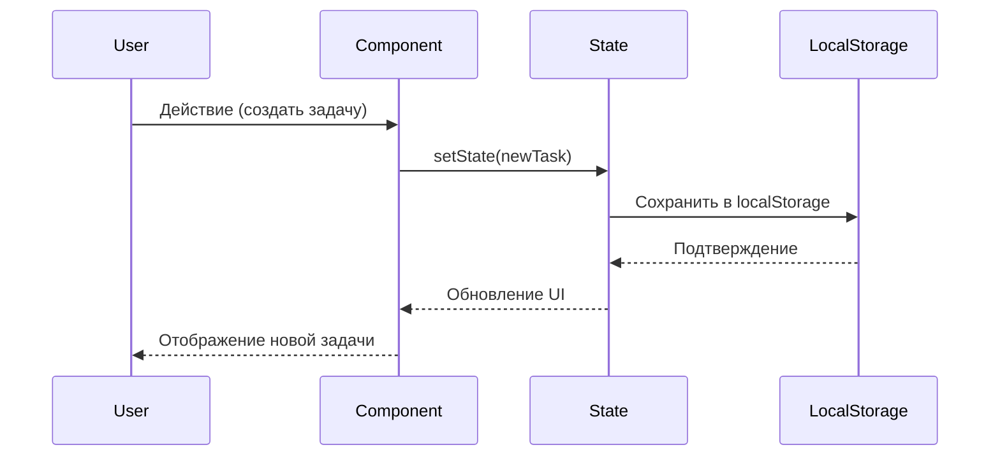

# Дизайн документации: TwoDo

## Обзор

Данный документ описывает дизайн полной документации для проекта TwoDo - React-приложения для совместного планирования задач между парами. Документация будет создана в формате Markdown и организована в виде набора взаимосвязанных файлов, охватывающих все аспекты проекта от установки до расширения функциональности.

## Архитектура документации

### Структура файлов

Документация будет организована следующим образом:

```
docs/
├── README.md                    # Главная страница документации
├── getting-started/
│   ├── installation.md          # Установка и настройка
│   ├── quick-start.md           # Быстрый старт
│   └── configuration.md         # Конфигурация (API ключи)
├── user-guide/
│   ├── overview.md              # Обзор приложения
│   ├── onboarding.md            # Первоначальная настройка
│   ├── tasks.md                 # Работа с задачами
│   ├── clusters.md              # Работа с кластерами
│   ├── notes.md                 # Работа с заметками
│   ├── shopping.md              # Список покупок
│   └── events.md                # События и календарь
├── architecture/
│   ├── overview.md              # Общая архитектура
│   ├── project-structure.md     # Структура проекта
│   ├── data-flow.md             # Поток данных
│   └── storage.md               # Механизм хранения
├── api/
│   ├── types.md                 # Типы данных
│   ├── components.md            # Документация компонентов
│   └── hooks.md                 # Пользовательские хуки (если есть)
├── development/
│   ├── setup.md                 # Настройка окружения разработки
│   ├── adding-features.md       # Добавление новых функций
│   ├── code-style.md            # Стиль кода и best practices
│   └── testing.md               # Тестирование (если применимо)
├── deployment/
│   └── production.md            # Развертывание в продакшен
└── troubleshooting/
    └── faq.md                   # FAQ и решение проблем
```


### Принципы организации

1. **Модульность**: Каждый раздел документации - отдельный файл для удобства навигации и обновления
2. **Прогрессивное раскрытие**: От простого к сложному - пользовательская документация перед технической
3. **Практичность**: Каждый раздел содержит примеры кода и практические сценарии
4. **Визуализация**: Использование диаграмм Mermaid для архитектурных схем
5. **Двуязычность**: Основная документация на русском, код и технические термины на английском

## Компоненты и интерфейсы

### Главная страница (README.md)

**Назначение**: Точка входа в документацию, обзор проекта и быстрая навигация

**Содержание**:
- Логотип и название проекта
- Краткое описание (2-3 предложения)
- Ключевые возможности (список)
- Скриншот главного экрана
- Быстрые ссылки на основные разделы
- Информация о технологиях
- Лицензия и контакты

**Формат**:
```markdown
# TwoDo - Планировщик для пар

[Логотип/Баннер]

Совместное планирование задач для двоих. Визуальный интерфейс с кластерами, 
задачами, заметками и списком покупок.

## Возможности
- 🎯 Управление задачами с приоритетами
- 📁 Кластеры для группировки задач
- 📝 Заметки
- 🛒 Список покупок
- 📅 События и календарь

[Навигация по разделам]
```


### Раздел установки (getting-started/)

#### installation.md

**Назначение**: Пошаговая инструкция по установке проекта

**Содержание**:
- Системные требования (Node.js версия)
- Клонирование репозитория
- Установка зависимостей
- Настройка переменных окружения
- Проверка установки

**Структура**:
```markdown
# Установка

## Системные требования
- Node.js >= 18.0.0
- npm >= 9.0.0 или yarn >= 1.22.0

## Шаги установки

### 1. Клонирование репозитория
[команды git clone]

### 2. Установка зависимостей
[команды npm install]

### 3. Настройка окружения
[создание .env.local]

### 4. Запуск
[команды npm run dev]
```

#### quick-start.md

**Назначение**: Быстрый старт для нетерпеливых пользователей

**Содержание**:
- Минимальный набор команд для запуска
- Первые шаги в приложении
- Ссылки на детальную документацию

#### configuration.md

**Назначение**: Детальная настройка конфигурации

**Содержание**:
- Переменные окружения (.env.local)
- Получение Google Gemini API ключа
- Опциональные настройки
- Примеры конфигурации


### Руководство пользователя (user-guide/)

#### overview.md

**Назначение**: Общий обзор приложения для пользователей

**Содержание**:
- Концепция приложения (планирование для пар)
- Основные разделы интерфейса
- Навигация (нижняя панель)
- Визуальная метафора (Hub, кластеры, задачи)

#### onboarding.md

**Назначение**: Руководство по первоначальной настройке

**Содержание**:
- Экран приветствия
- Создание профиля пользователя
- Приглашение партнера
- Первый кластер и задача

**Примеры**:
```markdown
## Создание профиля

1. При первом запуске вы увидите экран приветствия
2. Нажмите "Начать"
3. Введите ваше имя
4. (Опционально) Пригласите партнера через ссылку

[Скриншот экрана настройки]
```

#### tasks.md

**Назначение**: Полное руководство по работе с задачами

**Содержание**:
- Создание задачи
- Приоритеты (Low, Medium, High)
- Статусы (TODO, IN_PROGRESS, DONE)
- Назначение (Me, Partner, Both)
- Дедлайны
- Привязка к кластерам
- Перемещение задач на Dashboard
- Завершение задач


#### clusters.md

**Назначение**: Руководство по работе с кластерами

**Содержание**:
- Концепция кластеров (группировка задач)
- Создание кластера
- Выбор цвета (slate, rose, blue, emerald, amber, violet)
- Выбор размера (sm, md, lg)
- Перемещение кластеров на Dashboard
- Добавление задач в кластер
- Визуальная связь (линии между Hub и кластерами)

#### notes.md

**Назначение**: Работа с заметками

**Содержание**:
- Доступ к заметкам (через раздел Tasks → General)
- Создание заметки
- Редактирование заметки
- Удаление заметки
- Форматирование текста

#### shopping.md

**Назначение**: Использование списка покупок

**Содержание**:
- Добавление товара
- Категории товаров
- Отметка купленных товаров
- Удаление товаров
- Фильтрация (купленные/некупленные)

#### events.md

**Назначение**: Управление событиями

**Содержание**:
- Создание события
- Типы событий (DATE 💕, BIRTHDAY 🎂, TRIP ✈️, OTHER 📅)
- Дата и время
- Местоположение
- Описание
- Просмотр предстоящих событий


### Архитектура (architecture/)

#### overview.md

**Назначение**: Общая архитектура приложения

**Содержание**:
- Архитектурная диаграмма (Mermaid)
- Основные слои (UI, State, Storage)
- Технологический стек
- Архитектурные решения и их обоснование

**Диаграмма**:


#### project-structure.md

**Назначение**: Детальная структура проекта

**Содержание**:
- Дерево файлов и папок
- Назначение каждой директории
- Ключевые файлы (App.tsx, types.ts, vite.config.ts)
- Компоненты и их расположение

**Формат**:
```markdown
## Структура проекта

```
twodo/
├── components/          # React компоненты
│   ├── Dashboard.tsx   # Главный экран с визуализацией
│   ├── Tasks.tsx       # Управление задачами
│   ├── Notes.tsx       # Заметки
│   ├── Shopping.tsx    # Список покупок
│   ├── Events.tsx      # События
│   ├── Welcome.tsx     # Экран приветствия
│   └── UI.tsx          # Переиспользуемые UI компоненты
├── App.tsx             # Главный компонент приложения
├── types.ts            # TypeScript типы и интерфейсы
├── index.tsx           # Точка входа
├── vite.config.ts      # Конфигурация Vite
└── package.json        # Зависимости проекта
```
```


#### data-flow.md

**Назначение**: Описание потока данных в приложении

**Содержание**:
- Управление состоянием через React Hooks (useState)
- Персистентность через Local Storage
- Синхронизация состояния и хранилища
- Диаграмма потока данных

**Диаграмма потока**:


#### storage.md

**Назначение**: Механизм хранения данных

**Содержание**:
- Использование Local Storage
- Ключи хранения (twodo_tasks, twodo_clusters, etc.)
- Формат данных (JSON)
- Загрузка при инициализации
- Сохранение при изменениях (useEffect)
- Ограничения Local Storage
- Резервное копирование данных


### API документация (api/)

#### types.md

**Назначение**: Полная документация всех TypeScript типов

**Содержание**:

**Enum типы**:
```typescript
// Priority - Приоритет задачи
enum Priority {
  LOW = 'LOW',       // Низкий приоритет
  MEDIUM = 'MEDIUM', // Средний приоритет
  HIGH = 'HIGH'      // Высокий приоритет
}

// Status - Статус выполнения задачи
enum Status {
  TODO = 'TODO',               // К выполнению
  IN_PROGRESS = 'IN_PROGRESS', // В процессе
  DONE = 'DONE'                // Завершено
}

// Assignee - Кому назначена задача
enum Assignee {
  ME = 'ME',           // Мне
  PARTNER = 'PARTNER', // Партнеру
  BOTH = 'BOTH'        // Обоим
}

// EventType - Тип события
enum EventType {
  DATE = 'DATE',         // Свидание 💕
  BIRTHDAY = 'BIRTHDAY', // День рождения 🎂
  TRIP = 'TRIP',         // Поездка ✈️
  OTHER = 'OTHER'        // Другое 📅
}
```

**Интерфейсы**:
```typescript
// User - Пользователь
interface User {
  id: string;          // Уникальный идентификатор
  name: string;        // Имя пользователя
  initials: string;    // Инициалы для аватара
  avatarColor: string; // Цвет аватара
}

// Task - Задача
interface Task {
  id: string;          // Уникальный идентификатор
  title: string;       // Название задачи
  priority: Priority;  // Приоритет
  status: Status;      // Статус выполнения
  assignee: Assignee;  // Кому назначена
  deadline?: string;   // Дедлайн (опционально)
  createdAt: number;   // Timestamp создания
  clusterId?: string;  // ID кластера (опционально)
  x?: number;          // X позиция на Dashboard (%)
  y?: number;          // Y позиция на Dashboard (%)
}
```

[Продолжение для всех остальных интерфейсов: Cluster, Note, Event, ShoppingItem, AppState]


#### components.md

**Назначение**: Документация всех React компонентов

**Формат для каждого компонента**:
```markdown
### ComponentName

**Назначение**: [Краткое описание]

**Props**:
| Prop | Тип | Обязательный | Описание |
|------|-----|--------------|----------|
| propName | Type | Да/Нет | Описание |

**Пример использования**:
```tsx
<ComponentName 
  prop1={value1}
  prop2={value2}
/>
```

**Внутреннее состояние**: [Описание локального state]

**Основные методы**: [Ключевые функции компонента]
```

**Компоненты для документирования**:
1. **App** - Главный компонент приложения
2. **DashboardView** - Визуальный Dashboard с кластерами
3. **TasksView** - Управление задачами
4. **NotesView** - Работа с заметками
5. **ShoppingView** - Список покупок
6. **EventsView** - События и календарь
7. **WelcomeScreen** - Экран приветствия
8. **UI компоненты**:
   - Modal - Модальное окно
   - Input - Поле ввода
   - Select - Выпадающий список
   - Card - Карточка
   - PriorityBadge - Индикатор приоритета
   - AssigneeAvatar - Аватар исполнителя


### Руководство разработчика (development/)

#### setup.md

**Назначение**: Настройка окружения для разработки

**Содержание**:
- Рекомендуемые IDE (VS Code)
- Расширения для VS Code (ESLint, Prettier, TypeScript)
- Настройка линтеров
- Отладка в браузере
- Hot Module Replacement (HMR)

#### adding-features.md

**Назначение**: Руководство по добавлению новых функций

**Содержание**:

**Добавление нового типа данных**:
```markdown
1. Определить интерфейс в types.ts
2. Добавить в AppState
3. Создать useState в App.tsx
4. Добавить персистентность (useEffect + localStorage)
5. Передать в компоненты через props
```

**Добавление нового компонента**:
```markdown
1. Создать файл в components/
2. Определить Props интерфейс
3. Реализовать компонент
4. Импортировать в App.tsx
5. Добавить в навигацию (если нужно)
```

**Добавление нового раздела в навигацию**:
```markdown
1. Добавить тип в activeTab union
2. Создать NavItem в навигации
3. Добавить условный рендеринг в main
4. Создать соответствующий View компонент
```

#### code-style.md

**Назначение**: Стандарты кодирования

**Содержание**:
- TypeScript best practices
- Именование переменных и функций
- Структура компонентов
- Комментарии и документация
- Форматирование (Prettier конфигурация)
- Организация импортов


### Развертывание (deployment/)

#### production.md

**Назначение**: Руководство по развертыванию в продакшен

**Содержание**:

**Сборка проекта**:
```bash
npm run build
```

**Платформы для хостинга**:

1. **Vercel** (рекомендуется):
   - Создать аккаунт на vercel.com
   - Подключить GitHub репозиторий
   - Настроить переменные окружения
   - Автоматический деплой при push

2. **Netlify**:
   - Создать аккаунт на netlify.com
   - Drag & drop папки dist
   - Настройка переменных окружения
   - Настройка редиректов для SPA

3. **GitHub Pages**:
   - Настройка base в vite.config.ts
   - GitHub Actions для автоматического деплоя
   - Ограничения (только публичные репозитории)

**Настройка для HashRouter**:
- Объяснение использования HashRouter
- Преимущества для статического хостинга
- Альтернативы (BrowserRouter + server config)

**Переменные окружения в продакшене**:
- Настройка GEMINI_API_KEY
- Безопасность API ключей
- Использование секретов платформы


### Устранение неполадок (troubleshooting/)

#### faq.md

**Назначение**: Часто задаваемые вопросы и решения

**Содержание**:

**Установка и запуск**:
```markdown
Q: Ошибка при установке зависимостей
A: Убедитесь, что используете Node.js >= 18.0.0
   Попробуйте удалить node_modules и package-lock.json, затем npm install

Q: Приложение не запускается
A: Проверьте, что порт 5173 свободен
   Проверьте наличие .env.local файла
```

**Работа с данными**:
```markdown
Q: Потерялись все данные
A: Данные хранятся в Local Storage браузера
   Проверьте, не очищали ли вы кэш браузера
   Данные привязаны к домену - при смене URL данные не переносятся

Q: Как экспортировать данные?
A: Откройте DevTools → Application → Local Storage
   Скопируйте значения ключей twodo_*
   Сохраните в JSON файл для резервной копии
```

**Совместимость**:
```markdown
Q: Приложение не работает в браузере X
A: Поддерживаются современные браузеры:
   - Chrome/Edge >= 90
   - Firefox >= 88
   - Safari >= 14
   
Q: Не работает на мобильном устройстве
A: Проверьте версию браузера
   Убедитесь, что JavaScript включен
```

**Разработка**:
```markdown
Q: TypeScript ошибки при сборке
A: Запустите npm run build для проверки
   Проверьте версию TypeScript в package.json
   
Q: Hot reload не работает
A: Перезапустите dev сервер
   Проверьте конфигурацию Vite
```


## Модели данных

### Структура документа

Каждый документ документации следует единому шаблону:

```markdown
# [Название раздела]

> Краткое описание раздела (1-2 предложения)

## Содержание
- [Автоматически генерируемое оглавление]

## [Основной контент]

### [Подразделы]

## Примеры

[Практические примеры с кодом]

## См. также

- [Ссылки на связанные разделы]
```

### Стилистические соглашения

**Форматирование кода**:
- Блоки кода с указанием языка: ```typescript, ```bash, ```json
- Инлайн код в обратных кавычках: `variableName`
- Команды терминала с префиксом $: `$ npm install`

**Выделение важной информации**:
- ⚠️ **Важно**: Критическая информация
- 💡 **Совет**: Полезные рекомендации
- 📝 **Примечание**: Дополнительная информация
- ✅ **Рекомендуется**: Best practices

**Навигация**:
- Каждый документ содержит ссылки "Назад" и "Далее"
- Breadcrumbs в начале документа
- Ссылки на связанные разделы в конце


## Correctness Properties

*Свойство (property) - это характеристика или поведение, которое должно выполняться во всех валидных случаях работы системы - по сути, формальное утверждение о том, что система должна делать. Свойства служат мостом между человекочитаемыми спецификациями и машинно-проверяемыми гарантиями корректности.*

### Property Reflection

После анализа критериев приемки выявлены следующие паттерны:
- Большинство требований проверяют наличие конкретного контента (examples)
- Несколько требований проверяют свойства для всех элементов определенного типа (properties)
- Многие требования о наличии разделов можно объединить в свойства о полноте документации

**Объединенные свойства**:
- Требования 4.1-4.8 объединены в Property 1 (полнота документации компонентов)
- Требования 5.1-5.9 объединены в Property 2 (полнота документации типов)
- Требования 11.1-11.6 объединены в Properties 3-7 (форматирование и структура)


### Свойства корректности

Property 1: Полнота документации компонентов
*For any* React компонент в проекте TwoDo, документация должна содержать описание его назначения, всех props (с типами и описанием), и основных методов
**Validates: Requirements 4.1, 4.2, 4.3, 4.4, 4.5, 4.6, 4.7, 4.8**

Property 2: Полнота документации типов данных
*For any* TypeScript интерфейс или enum в types.ts, документация должна содержать описание типа и объяснение назначения каждого поля
**Validates: Requirements 5.1, 5.2, 5.3, 5.4, 5.5, 5.6, 5.7, 5.8, 5.9**

Property 3: Язык документации
*For any* файл документации, основной текст должен быть написан на русском языке (за исключением кода и технических терминов)
**Validates: Requirements 11.1**

Property 4: Формат файлов
*For any* файл документации, он должен иметь расширение .md и использовать корректный Markdown синтаксис
**Validates: Requirements 11.2**

Property 5: Иерархическая структура
*For any* файл документации, заголовки должны следовать правильной иерархии (# → ## → ### без пропусков уровней)
**Validates: Requirements 11.3**

Property 6: Единообразие форматирования
*For any* два файла документации, они должны использовать одинаковый стиль форматирования (блоки кода, списки, выделение текста)
**Validates: Requirements 11.4**

Property 7: Навигационные ссылки
*For any* файл документации, содержащий ссылки на другие разделы, эти ссылки должны быть валидными и вести на существующие файлы
**Validates: Requirements 11.5**

Property 8: Блоки кода с языком
*For any* блок кода в документации, он должен указывать язык программирования для подсветки синтаксиса (```typescript, ```bash, etc.)
**Validates: Requirements 11.6**


## Обработка ошибок

### Отсутствующие файлы

**Проблема**: Ссылка на несуществующий файл документации

**Решение**:
- Валидация всех ссылок перед публикацией
- Использование относительных путей
- Проверка существования файлов при сборке

### Некорректный Markdown

**Проблема**: Синтаксические ошибки в Markdown

**Решение**:
- Использование Markdown линтера (markdownlint)
- Автоматическая проверка при коммите
- Предпросмотр перед публикацией

### Устаревшая информация

**Проблема**: Документация не соответствует текущей версии кода

**Решение**:
- Версионирование документации вместе с кодом
- Регулярный аудит документации
- Комментарии в коде со ссылками на документацию

### Неполная документация

**Проблема**: Отсутствуют разделы или описания

**Решение**:
- Чеклист обязательных разделов
- Автоматическая проверка полноты (скрипты)
- Code review включает проверку документации


## Стратегия тестирования

### Подход к тестированию

Документация будет проверяться двумя способами:

1. **Unit тесты**: Проверка конкретных примеров и наличия обязательных разделов
2. **Property-based тесты**: Проверка универсальных свойств для всех документов

### Unit тестирование

**Цель**: Проверить наличие конкретных разделов и контента

**Примеры тестов**:
- Проверка наличия README.md с описанием проекта
- Проверка наличия installation.md с командами установки
- Проверка наличия всех обязательных файлов в структуре
- Проверка наличия описания для каждого компонента
- Проверка наличия FAQ раздела

**Инструменты**:
- Node.js скрипты для проверки файловой структуры
- Регулярные выражения для поиска обязательного контента
- Markdown парсеры для проверки структуры

### Property-based тестирование

**Цель**: Проверить универсальные свойства для всех документов

**Конфигурация**:
- Минимум 100 итераций на тест
- Использование библиотеки fast-check (для JavaScript/TypeScript)
- Каждый тест помечен комментарием с ссылкой на свойство из дизайна

**Примеры property тестов**:

```typescript
// Feature: twodo-documentation, Property 1: Полнота документации компонентов
test('All components have complete documentation', () => {
  fc.assert(
    fc.property(
      fc.constantFrom(...getAllComponents()),
      (component) => {
        const doc = getComponentDocumentation(component);
        return (
          doc.hasDescription() &&
          doc.hasAllPropsDocumented() &&
          doc.hasMethodsDocumented()
        );
      }
    ),
    { numRuns: 100 }
  );
});

// Feature: twodo-documentation, Property 4: Формат файлов
test('All documentation files are valid Markdown', () => {
  fc.assert(
    fc.property(
      fc.constantFrom(...getAllDocFiles()),
      (file) => {
        return (
          file.endsWith('.md') &&
          isValidMarkdown(file)
        );
      }
    ),
    { numRuns: 100 }
  );
});

// Feature: twodo-documentation, Property 5: Иерархическая структура
test('All documentation files have proper heading hierarchy', () => {
  fc.assert(
    fc.property(
      fc.constantFrom(...getAllDocFiles()),
      (file) => {
        const headings = extractHeadings(file);
        return hasProperHierarchy(headings);
      }
    ),
    { numRuns: 100 }
  );
});
```

### Автоматизация проверок

**Pre-commit хуки**:
- Проверка Markdown синтаксиса
- Проверка наличия обязательных разделов
- Валидация ссылок

**CI/CD пайплайн**:
- Запуск всех тестов документации
- Генерация отчета о покрытии
- Проверка битых ссылок
- Сборка статического сайта документации

### Ручная проверка

**Чеклист для ревью**:
- [ ] Все разделы присутствуют
- [ ] Примеры кода работают
- [ ] Скриншоты актуальны
- [ ] Ссылки работают
- [ ] Текст понятен и без ошибок
- [ ] Форматирование единообразно
